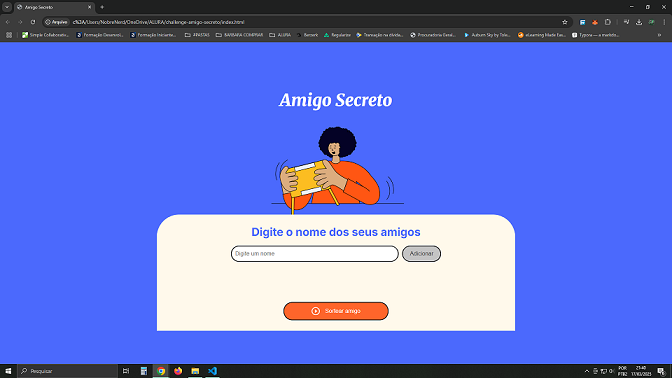
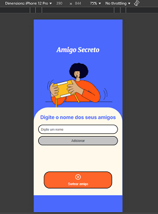

# 🎯 Challenge AMIGO SECRETO (Alura)

Este é um projeto dinamico e objetivo para **sortear um amigo secreto**, ideal para confraternizações entre amigos, funcionários da sua empresa, festas de aniversários, entre outros.

## 📸 Demonstração

- Site aberto em um Desktop:
  


- Site aberto em um Celular (Mobile):
  


## 🚀 Tecnologias utilizadas

- HTML5
- CSS3 (com uso de variáveis, flexbox e responsividade)
- JavaScript (manipulação de DOM e lógica do sorteio)

## 📱 Responsividade

O layout foi adaptado para funcionar perfeitamente em dispositivos móveis e desktops, garantindo uma ótima experiência do usuário em qualquer tela.
Efetuei algumas alterações de alinhamento no projeto base na parte de CSS para que o site fique totalmente resposivo.

## 📂 Estrutura do projeto

```
├── index.html
├── style.css
├── script.js
└── README.md
```

## 📋 Como usar

1. Abra o projeto já compilado para teste pelo endereço:
https://challenge-amigo-secreto-one-pi.vercel.app/

2. Digite os nomes no campo de entrada e clique em **"Adicionar"**.

3. Clique em **"Sortear amigo"** para que seu amigo secreto seja mostrado.

## 🤝 Contribuindo

Contribuições são bem-vindas! Sinta-se à vontade para abrir issues, propor melhorias ou enviar pull requests.


Feito por Bruno Nobre Santos (Nobre Nerd)
https://github.com/NobreNerd/
